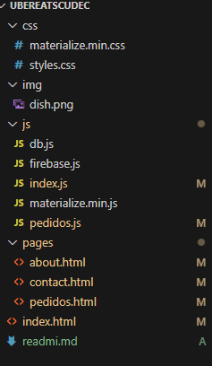
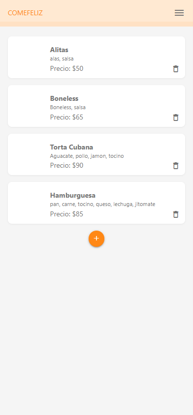
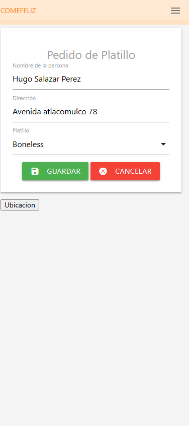
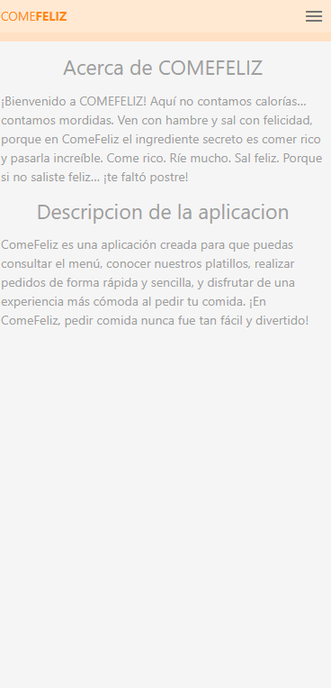

1. Título del proyecto

### COMEFELIZ

**ComeFeliz** es una aplicación de restaurante que permite consultar el menú, elegir tus platillos favoritos y realizar pedidos de manera rápida, sencilla y divertida

**Tipo de aplicación**: PWA

**COMEFELIZ** es una aplicación de restaurante que permite consultar el menú, elegir tus platillos favoritos y realizar pedidos de manera rápida, sencilla y divertidaDescripción en una o dos línea

**TALLER DE PROGRAMACION AVANZADA II**, **INGENIERIA EN SISTEMAS COMPUTACIONALES**, **HUGO SALAZAR PEREZ**.

2. Descripción del proyecto

### Problema que resuelve

**COMEFELIZ** busca facilitar y agilizar el proceso de pedir comida, evitando largas esperas y haciendo más sencillo consultar el menú y realizar pedidos.

### Usuarios

Está dirigida a **clientes que desean pedir comida de manera rápida y sencilla**, así como al **personal del restaurante**, que puede gestionar los pedidos de forma organizada.

### Propósito

El propósito de **COMEFELIZ** es ofrecer una plataforma práctica para mejorar la experiencia de los clientes y facilitar la administración de pedidos del restaurante

3. Objetivos

### Objetivo General

Desarrollar una aplicación para **ComeFeliz** que permita a los clientes consultar el menú y realizar pedidos de manera **rápida, sencilla y organizada**, mejorando su experiencia y facilitando la gestión de pedidos del restaurante.Objetivo general
Describe el propósito principal del desarrollo

### Objetivos específicos

* Permitir a los usuarios consultar el menú y los platillos disponibles.
* Facilitar la selección y realización de pedidos.
* Ofrecer una interfaz sencilla, rápida y fácil de utilizar.
* Mantener informados a los clientes sobre el estado de sus pedidos.
* Mejorar la experiencia de los clientes al solicitar sus alimentos

4. Características principales

### Funcionalidades implementadas

* Visualización del menú y platillos disponibles.
* Selección de productos y creación de pedidos.
* Gestión de información de los platillos.
* Administración y seguimiento de pedidos.
* Interfaz sencilla y fácil de utilizar.
*  Sección de soporte y contacto

5. Tecnologías utilizadas

### Indicar las tecnologías y versiones relevantes.

* **HTML5** – Estructura de la aplicación web..
* **Firebase** – Base de datos y autenticación.
* **Visual Studio Code** – Entorno de desarrollo

6. Estructura del proyecto

7. Evidencias / capturas de pantalla

Agregar imágenes de las principales pantallas:

8. Base de datos

**Motor utilizado:**
Firebase Firestore, utilizado para almacenar y gestionar la información de la aplicación de manera segura y en tiempo real.

**Colecciones principales:**

*  **platillos:** nombre, descripción, precio e imagen de los productos.
*  **pedidos:** información de los pedidos realizados por los usuarios.
*  **detallePedidos:** productos incluidos en cada pedido, cantidades y precios

9. Licencia

### Licencia

Este proyecto fue desarrollado **exclusivamente con fines académicos**, como parte de la carrera de **Ingeniería en Sistemas**, para la materia correspondiente al proyecto, del **grupo académico**, en la **Universidad Multicultural CUDEC**.

El proyecto no tiene fines comerciales y su uso está destinado a actividades educativas, demostrativas y de aprendizaje.
